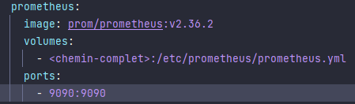

# TuCarbure API

## Prérequis

- Docker
- Java 17 ou supérieur
- Maven pour build le .jar


## Installation

- Récupérer le projet :

```bash
git clone https://github.com/TheSliKe/TuCarbureAPI.git
cd TuCarbureAPI
```

### Docker
- Modifier dans le fichier docker-compose.yml (./docker) le chemin complet vers prometheus.yml

    

- Ouvrir ensuite le dossier docker dans un terminal et lancer le docker-compose de la manière suivante :
```bash
docker-compose up --build --force-recreate
```

### Spring App

- A la racine du projet lancer le build du .jar:

```bash
mvn package
```

-un .jar à été généré et peut être lancer depuis le dossier target: 
```bash
cd target
java -jar <jar name>
```

## Information

Le swagger est disponible a l'adresse suivante :
- localhost:8080/swagger-ui/index.html


